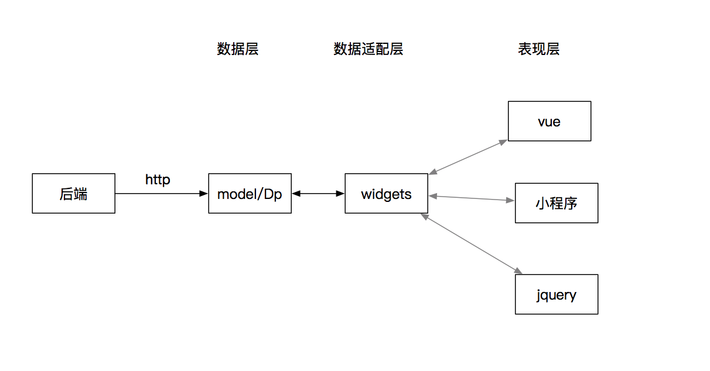

Ledap
-----


## Ledap是什么？
由于vue，angularJs,react的出现，使得前端能够很方便地实现页面上的侦听和dom操作，然而却带来一个新的问题：将后端数据渲染为html。该问题极大地加剧了整个前端开发的复杂度，并且前端带了特别多的问题：

* 业务问题。前端需要跟据业务逻辑来展示不同的页面，而业务逻辑部分在后端实现了一次，而在前端往往需要再实现一次，而且维护起来极为复杂。
* 目前的前端框架没有清晰的分层，使得代码逻辑散乱，不容易维护。  

本框架将有如下的优点：

* 可扩展性好。在小程序，vue, angular,jquery等框架中均可以使用。
* 设计清晰简单，易于使用。

## 安装
运行如下命令进行安装：

```bash
npm i ledap --save
```
也可以在package.json中,加入如下的行, 然后执行`npm install`：

```javascript
"ledap": "^0.1.1"
```

## 使用

### 代码示例
本代码中有丰富的代码示例。

1. 首先下载代码或glone至本地。
2. cd进入工程目录,运行`npm install`下载npm依赖。
3. 运行`npm run dev`来编译线下测试代码。
4. 运行`npm run init`来初始化example环境。
5. 运行`npm run example`来启动http服务器。
6. 在浏览器中输入 http://localhost:8000 即可访问example中的示例了。


### 主要设计分层
整个框架的具体分层如下所示：


如上图所示，数据层是后端数据在前端的映射，业务相关的代码应尽量放置在数据层。数据适配层也可以叫做逻辑组件层，本质上是将数据转换为组件，有适配层的存在，可以在多个框架中保持一致的逻辑（如小程序和vue中）。组件层是具体的实现层，跟具体的框架相关，本框架目前主要实现了少量vue的组件。

### 基本数据层
* [Model](docs/Model.md)
* [DataProvider](docs/DataProvider.md)
* [Event](docs/Event.md)
* 其它，如pagination等。

### 组件

在ledap中，把组件分为如下两类：

* **逻辑组件**:在本框架中叫widget,跟具体的框架实现无关，可以在多个框架中使用。
* **展示组件**：在本框架中叫component, 具体的逻辑实现，跟具体的框架有关。

本质上，逻辑组件将常规组件背后的逻辑抽离，让它可以在不同的框架间复用。展示组件是逻辑组件的具化，跟框架是相关的。

下面，我们以group来举列说明：
group是可能是一个按钮组，一个Checkbox Group，或者Radio Group等，不管它样子怎么变化，我们大体上可以看出背后的数据逻辑如下：

* group是一组组件(数组)，由group来管控子组件的开和关
* group的已选中是一个队列，radiogroup, 按钮组为单选，CheckBox为多选。
* group可能可以取消选中

因此，我把上述逻辑全部写入逻辑组件的Group中，而展示组件中，我们可以直接使用，下面，我们来看一下示例:

如下为逻辑组件Group的示例代码，它可以把component加入管理，component必须符合group的接口规范，如果不符合，不会报错，但是group并不管理该组件。

```javascript
import { Group } from 'ledap';

var group = new Group();
// 允许选中的最大个数
group.max = 1;
group.excludes = [];

// 添加被group管理
group.add(component);
//选中某个选项
group.select("1");
// 取消某个选项
group.unselect("1");
// group当前选中的选项。
group.selected
```

#### Vue中的示例

如下为vue展示组件的示例, 它本质上就只是将上面的代码写在了vue组件中。这样，我们就能看见正确的的交互了。

``` javascript
import {LedapVue} from 'ledap'
const group = LedapVue.group;
const tab = LedapVue.tab;
// 注册group组件
Vue.component(group.name, group);
// 注册tab组件
Vue.component(tab.name, tab);
```
view页展示如下:

```html
<group max="1" multiple="false">
    <tab href="xxx">tab1</tab>
    <tab href="xxx">tab2</tab>
    <div>xxx</div>
</group>
```

#### JQuery中的示例
上面我们来实现一个Jquery中组件逻辑, 它全将对应dom的元素直接交给group管理

```javascript
import {Group} from 'ledap'

function getComponent(key)
{
    // 实现接口协议
    return {
        dom : $(key),
        isOpen : function(){
            this.dom.hasClass("active");
        },
        open : function(){
            this.dom.addClass("active");
        },
        close : function(){
            this.dom.removeClass("active")
        }
    }
}

var group = new Group();
group.multiple = false;
var component1 = getComponent("#id1");
var component2 = getComponent(".class1");
group.add(component1);
group.add(component2);
```

#### 组件列表
目前主要实现的组件为vue组件，列表如下：

| 组件   |     逻辑组件     | 展示组件(vue) | 
|----------|:-------------:|------:|
| 单选,选项卡|  Group | Group, Tab|
| 表格 |    Column   |  Grid, Detailview|
| 分页器| Pagination | Pager|

### 页面分类

ledap把前端常见的页面分为如下三类:

* [列表页](docs/ListPage.md)
* [提交&修改页](docs/UpdatePage.md)
* 信息展示页

### 代码自动生成
做了上面的代码分层后，使得后续代码的自动生成变的有可能了，因此，后续会考虑代码自动生成。

